# 👋 Hey, I'm Rudra

> **Software Engineer building production systems that actually ship** • Currently @ Lewis University (May 2026) • 3.87 GPA • Chicago, IL

I turn messy ideas into clean, scalable code. Whether it's cutting load times by 83%, processing 2.4M events/day, or building e-commerce platforms that drive real revenue — I focus on **impact over résumé fluff**.

<div align="left">
  
[](https://www.linkedin.com/in/rudrapatel09/)
[](https://rudras-website.vercel.app/)
[](mailto:rudrap26176@gmail.com)
  
</div>

---

## What I Actually Do

```typescript
const skills = {
    backend: ["Python", "Java", "FastAPI", "Spring Boot", "Node.js"],
    frontend: ["React", "TypeScript", "Tailwind"],
    databases: ["PostgreSQL", "Redis", "TimescaleDB", "Firebase"],
    infrastructure: ["Docker", "AWS", "GCP", "Azure", "CI/CD"],
    ml: ["Scikit-learn", "TensorFlow", "NLP"],
    
    currentlyLearning: "System Design & Distributed Systems",
    openTo: "SWE Internships & Full-time (2026)"
};
```

---

## 💼 Recent Work

### **Hometown Liquor E-Commerce** `May 2025 - Jul 2025`
Built a full-stack platform that **increased monthly revenue 45% to $40K**
- **Stack:** React, TypeScript, FastAPI, PostgreSQL, Docker
- **Impact:** 750+ products, sub-200ms search, 89 REST endpoints
- Automated POS inventory sync across distributed stores
- JWT auth, role-based access, guest checkout flow

### **QuizMaster** `Aug 2025 - Dec 2025`
Led team of 6 through 30K-line codebase optimization
- **Stack:** React, Node.js, Firebase, GCP, GitHub Actions
- **Impact:** 83% faster load times (30s → <5s), 89% smaller bundle
- Eliminated N+1 queries, migrated deprecated functions
- Built CI/CD pipeline reducing deployment time 37%

---

## 🚀 Side Projects Worth Checking

<table>
<tr>
<td width="50%">

### [Analytics Pipeline](https://github.com/rpat9/Analytics-Pipeline)
Real-time event processing system simulating production infrastructure
- **2.4M events/24hrs** @ 28 events/sec
- Redis Streams + TimescaleDB hypertables
- **55x faster** dashboard queries (1.8s → 33ms)
- React dashboard with 5s auto-refresh

`TypeScript` `Redis` `TimescaleDB` `Docker` `Node.js`

</td>
<td width="50%">

### [Social Media Sentiment Classifier](https://github.com/rpat9/sentiment-analysis)
ML model comparing 3 approaches on 241K posts
- **78% accuracy** with Logistic Regression
- GridSearchCV testing 192 combinations
- Cross-dataset validation proving domain > complexity
- TF-IDF, Bag-of-Words, RoBERTa comparison

`Python` `Scikit-learn` `NLP` `GridSearchCV`

</td>
</tr>
<tr>
<td width="50%">

### [MasterChef Claude](https://github.com/rpat9/MasterChef-Claude)
AI recipe generator with smart error handling
- Custom recipes in **<3 seconds**
- 3-layer error handling system
- Docker deployment on AWS
- Real-time streaming responses

`React` `Claude API` `Firebase` `Docker` `Tailwind`

</td>
<td width="50%">

### [Personal Website](https://github.com/rpat9/rudras-website)
Portfolio showcasing projects & experience
- Responsive design
- Project decks
- Deployed on Vercel
- Performance optimized

`TypeScript` `React` `Tailwind` `Vercel`

</td>
</tr>
</table>

---

## 📈 GitHub Stats

<div align="center">




</div>

---

## Quick Wins I'm Proud Of

| Achievement | Impact |
|-------------|--------|
|  E-commerce revenue | **+45%** to $40K/month |
|  Dashboard load time | **30s → 5s** (83% faster) |
|  Bundle size | **16.1MB → 1.7MB** (89% reduction) |
|  Search latency | **Sub-200ms** on 750+ products |
|  Query performance | **1.8s → 33ms** (55x improvement) |

---

## 🧰 Tech I Actually Use

**Languages:** Python • Java • TypeScript/JavaScript • SQL • HTML/CSS

**Frameworks:** React • Spring Boot • FastAPI • Node.js • Express • Tailwind

**Data:** PostgreSQL • Redis • TimescaleDB • Firebase • MySQL • MongoDB

**Tools:** Docker • Git • GitHub Actions • AWS • GCP • Azure • Figma

**Concepts:** REST APIs • Microservices • Event-driven Architecture • System Design • CI/CD • JWT Auth

---

## 📬 Let's Talk

Looking for **Software Engineering opportunities** where I can:
- Build scalable systems that handle real traffic
- Optimize performance where it actually matters
- Work with teams that ship fast and iterate faster

**Open to:** Internships & Full-time roles starting 2026

Hit me up: **rudrap26176@gmail.com** or connect on [LinkedIn](https://www.linkedin.com/in/rudrapatel09/)

---

<div align="center">
  
*"Code is poetry written in logic"*


</div>
